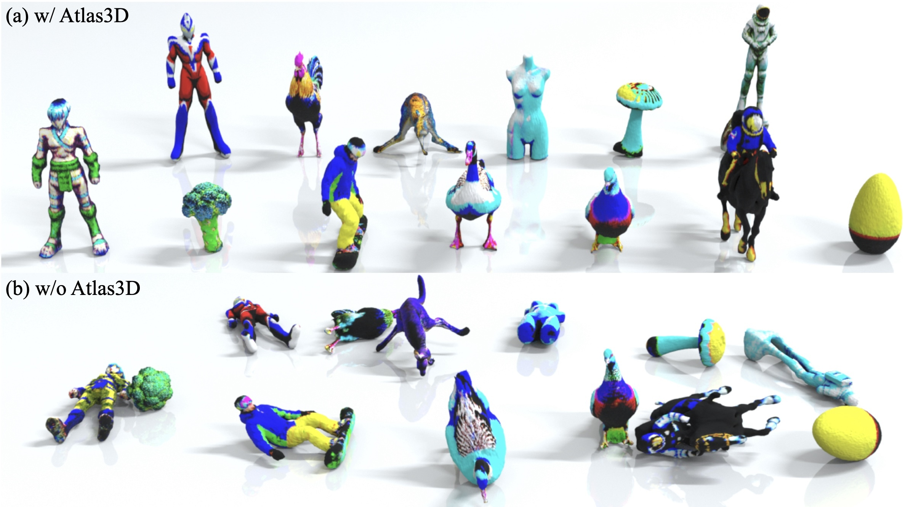

# Atlas3D: Physically Constrained Self-Supporting Text-to-3D for Simulation and Fabrication

### [[Project Page](https://yunuoch.github.io/Atlas3D/)] [[arXiv](https://arxiv.org/abs/xxxx.xxxxx)]

Yunuo Chen1\*, Tianyi Xie1\*, Zeshun Zong1\*, Xuan Li1, Feng Gao2, Yin Yang3, Ying Nian Wu1, Chenfanfu Jiang1 
1University of California, Los Angeles, 2Amazon<small><small><small>(This work is not related to F. Gao’s position at Amazon.)</small></small></small>, 3University of Utah  
*Equal contributions

Abstract: *Existing diffusion-based text-to-3D generation methods primarily focus on producing visually realistic shapes and appearances, often neglecting the physical constraints necessary for downstream tasks. Generated models frequently fail to maintain balance when placed in physics-based simulations or 3D printed. This balance is crucial for satisfying user design intentions in interactive gaming, embodied AI, and robotics, where stable models are needed for reliable interaction. Additionally, stable models ensure that 3D-printed objects, such as figurines for home decoration, can stand on their own without requiring additional supports. To fill this gap, we introduce Atlas3D, an automatic and easy-to-implement method that enhances existing Score Distillation Sampling (SDS)-based text-to-3D tools. Atlas3D ensures the generation of self-supporting 3D models that adhere to physical laws of stability under gravity, contact, and friction. Our approach combines a novel differentiable simulation-based loss function with physically inspired regularization, serving as either a refinement or a post-processing module for existing frameworks. We verify Atlas3D's efficacy through extensive generation tasks and validate the resulting 3D models in both simulated and real-world environments.*

<!-- # Website License
 This work is licensed under a <a rel="license" href="http://creativecommons.org/licenses/by-sa/4.0/">Creative Commons Attribution-ShareAlike 4.0 International License</a>. -->
